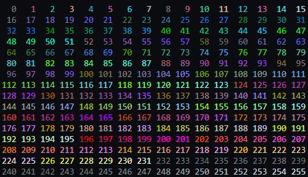

# CPPConsole

CPPConsole is a header-only library for `C++` projects that adds features to the console to make logging easier, like getting dimensions, coloring text, etc.

## Using CPPConsole

To use CPPConsole in your project, copy all the file located in the `include/` directory into your own personal `include/` folder.

After that, you can add `#include "cppconsole.hpp"` to your file to include all CPPConsole functions, or include each file individually.

## Features

* ANSI Escape Code support
* Cross-platform support for Windows and Linux for most functions
* Colorizing text using RGB values
* Moving the Console cursor
* Getting Console Dimensions
* Clearing parts of the Console
* Manipulating text graphics, like making text bold/italic
* Printing data structures, like vectors and maps

## Examples

``` cpp
std::vector<std::string> vec = {"a", "b", "c", "d", "e"};
vec[0] = console::colorize(vec[0], 255, 255, 0);
console::println(vec);
```

``` cpp
console::set({console::Graphics::BOLD, console::Graphics::ITALIC});
console::Dimensions dim = console::getDimensions();
for (int i = 0; i < 256; ++i) {
    if (i % (dim.width / 4) == 0)
        console::println();
    console::print(console::colorize(std::string(3 - std::to_string(i).length(), ' ') + std::to_string(i), i) + " ");
}
```

## Screenshots




## Usage

`console::print` and `console::println` are the main function that are used for printing. These work with any data structure, from primitives to vectors and maps.

`console::printAll` and `console::printlnAll` take an infinite amount of arguments, seperating them by spaces

`console::colorize` takes a string and then a color, changing the color of the text

`console::set` takes a list of graphics modes, and sets them all (like BOLD and ITALIC)

`console::clearGraphics` clears all previous graphics modes.

More function can be found throughout the files.

## Contributing

If you'd like to contribute to CPPConsole, or would like to report an issue, please read the [Contributing Guidelines](./.github/CONTRIBUTING.md)

## License

CPPConsole is licensed under the [MIT License](./LICENSE)

## Changelog

CPPConsole's changlog, which includes previous changes and upcoming changes, can be found in [CHANGELOG.md](./CHANGELOG.md)
